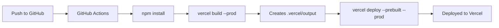

# Custom Skew Protection for Next.js on Vercel

A complete Next.js application demonstrating manual skew protection using the `__vdpl` cookie in middleware. This ensures users remain pinned to a specific deployment during rollouts, preventing version skew issues.

## What is Skew Protection?

Skew protection prevents users from hitting different versions of your application during a deployment. Without it, a user might:
- Load HTML from deployment A
- Load JavaScript assets from deployment B
- Make API calls to deployment C

This can cause:
- Runtime errors from API/frontend mismatches
- Broken functionality
- Poor user experience

## How This Works

1. **Middleware intercepts requests** - All incoming requests pass through Next.js middleware
2. **Cookie is set** - The `__vdpl` cookie is set to the current `VERCEL_DEPLOYMENT_ID`
3. **Session is pinned** - All subsequent requests (HTML, assets, API calls) include this cookie
4. **Vercel routes consistently** - Vercel's infrastructure routes all requests with the same `__vdpl` to the same deployment
5. **Users stay on one version** - Each user stays on the deployment they first landed on until the cookie expires

## Project Structure

```
custom-skew-protection/
├── .github/
│   └── workflows/
│       └── deploy.yml          # GitHub Actions workflow for Vercel deployment
├── app/
│   ├── api/
│   │   └── deployment-info/
│   │       └── route.ts        # API route showing deployment info
│   ├── test/
│   │   └── page.tsx            # Test page to verify skew protection
│   ├── globals.css             # Global styles
│   ├── layout.tsx              # Root layout
│   └── page.tsx                # Home page with deployment info
├── middleware.ts               # Skew protection middleware (sets __vdpl cookie)
├── next.config.js              # Next.js configuration
├── package.json                # Dependencies and scripts
└── tsconfig.json               # TypeScript configuration
```

## Setup Instructions

### Prerequisites

- Node.js 18+ installed
- A Vercel account
- A GitHub repository
- Vercel CLI installed: `npm install -g vercel`

### 1. Clone and Install

```bash
git clone <your-repo-url>
cd custom-skew-protection
npm install
```

### 2. Local Development

```bash
npm run dev
```

Visit `http://localhost:3000` to see the app. In development, the deployment ID will show as "development" since `VERCEL_DEPLOYMENT_ID` is only set in Vercel environments.

### 3. Vercel Project Setup

#### Option A: Using Vercel CLI

```bash
# Login to Vercel
vercel login

# Link to a new or existing project
vercel link

# This creates a .vercel directory with project settings
```

#### Option B: Using Vercel Dashboard

1. Go to [vercel.com](https://vercel.com)
2. Click "Add New Project"
3. Import your GitHub repository
4. Configure project settings (Next.js will be auto-detected)
5. Deploy

### 4. GitHub Actions Setup

To enable automated deployments via GitHub Actions:

1. **Get your Vercel Token**
   - Go to [Vercel Account Settings > Tokens](https://vercel.com/account/tokens)
   - Create a new token
   - Copy the token value

2. **Add GitHub Secret**
   - Go to your GitHub repository
   - Settings > Secrets and variables > Actions
   - Click "New repository secret"
   - Name: `VERCEL_TOKEN`
   - Value: Paste your Vercel token
   - Click "Add secret"

3. **Configure Vercel Project IDs**

   After running `vercel link`, you'll have a `.vercel/project.json` file. The workflow uses `vercel pull` to fetch this automatically, but ensure you've linked your project first.

4. **Push to trigger deployment**

```bash
git add .
git commit -m "Initial commit with skew protection"
git push origin main
```

The GitHub Action will:
- Install dependencies
- Run `vercel build --prod` to build the project
- Run `vercel deploy --prebuilt --prod` to deploy the build output
- Deploy to production on pushes to `main`
- Deploy preview deployments on pull requests

## Testing Skew Protection

### 1. View Deployment Info

Visit the home page to see:
- Current deployment ID
- The `__vdpl` cookie value
- Environment information

### 2. Test API Route

Click "Check API Deployment" or visit `/api/deployment-info` to verify the API is served from the same deployment.

### 3. Test Navigation

Navigate to the Test Page (`/test`) to verify:
- The same deployment ID appears on all pages
- The cookie persists across page navigation
- Match status shows "✓ Matched"

### 4. Test During Deployment

1. Make a change to the code
2. Deploy to Vercel
3. While the deployment is rolling out, open the app in multiple tabs
4. Verify that existing sessions stay on the old deployment
5. New sessions (new incognito windows) will get the new deployment

## Key Files Explained

### `middleware.ts`

The heart of skew protection. This file:
- Intercepts all requests before they reach your pages/API
- Checks for the `__vdpl` cookie
- Sets the cookie to `VERCEL_DEPLOYMENT_ID` if not present
- Ensures the cookie is HttpOnly, Secure (in production), and SameSite
- Has a 1-hour expiration (configurable)

### `.github/workflows/deploy.yml`

Automated deployment workflow that:
- Runs on pushes to `main` (production) and pull requests (preview)
- Uses `vercel build --prod` to create `.vercel/output`
- Uses `vercel deploy --prebuilt` to deploy the pre-built output
- Avoids rebuilding on Vercel's servers (faster, more consistent)

### `app/page.tsx`

Demonstrates server-side cookie access and displays:
- Deployment information
- Cookie status
- How skew protection works

## Environment Variables

These are automatically set by Vercel:

- `VERCEL_DEPLOYMENT_ID` - Unique ID for each deployment
- `VERCEL_ENV` - Environment type (production/preview/development)
- `VERCEL_REGION` - Region where the function is running

No additional environment variables are required for skew protection to work.

## Deployment Workflow



## Benefits of This Approach

1. **No version skew** - Users stay on consistent deployment versions
2. **Automatic** - Middleware handles everything transparently
3. **Works everywhere** - Applies to pages, API routes, and static assets
4. **Configurable** - Cookie duration and settings can be adjusted
5. **Debuggable** - Deployment ID visible in responses and headers

## Cookie Configuration

The `__vdpl` cookie is configured with:

- **Path**: `/` (applies to all routes)
- **MaxAge**: 3600 seconds (1 hour)
- **HttpOnly**: `true` (not accessible via JavaScript)
- **Secure**: `true` in production (HTTPS only)
- **SameSite**: `lax` (CSRF protection)

You can adjust these settings in `middleware.ts` based on your needs.

## Troubleshooting

### Cookie not appearing in development

The `VERCEL_DEPLOYMENT_ID` is only set in Vercel environments. In local development, you'll see "development" as the deployment ID, and the cookie logic won't activate the same way.

### Different deployment IDs on different requests

This likely means:
- The cookie expired (default 1 hour)
- The user cleared cookies
- The user is in a different browser/incognito window
- A new deployment rolled out and the user got a new session

### GitHub Actions failing

Ensure:
- `VERCEL_TOKEN` secret is set in GitHub
- You've run `vercel link` locally to set up the project
- Your Vercel project exists and is accessible

## Further Reading

- [Vercel Skew Protection Docs](https://vercel.com/docs/deployments/skew-protection)
- [Next.js Middleware](https://nextjs.org/docs/app/building-your-application/routing/middleware)
- [Vercel CLI](https://vercel.com/docs/cli)

## License

MIT
